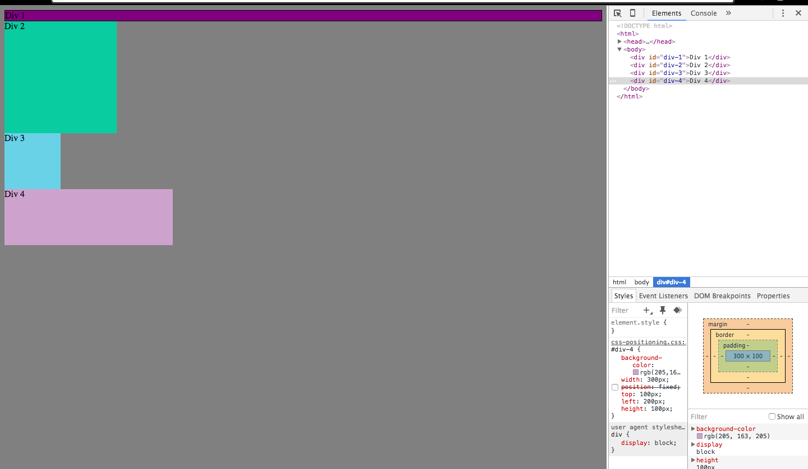

1. How can you use Chrome's DevTools inspector to help you format or position elements?
  Chrome's DevTools are really great for testing and figuring out position. It provides a very quick way to temporarily change the CSS or HTML and see how that affects the page. It is much quicker than physically changing the CSS or HTML file, and reloading the page each and every time.

2. How can you resize elements on the DOM using CSS?
  Resizing can easily be done with a few different properties. The ones that were most used in this challenge was heigth and width. For example, someone could type "height: 5px;".

3. What are the differences between absolute, fixed, static, and relative positioning? Which did you find easiest to use? Which was most difficult?
  *Absolute - Object is positioned relative to its nearest ancestor.
  *Fixed - Object is positioned relative to the window. It stays in the exact same spot regardless of scrolling around the page.
  *Static - This is the default positioning of an image.
  *Relative - This positioning places an object relative to its default position.

4. What are the differences between margin, border, and padding?
  *Margin - How much space is around the content, creating breathing room for whatever content you have. This is the furthest away from the content of the three.
  *Border - This is the on the outside of the actual content. This basically the edge of the element. It lives between margin and padding.
  *Padding - This is the closest to the content. This directly affects the area of the content.

5. What was your impression of this challenge overall? (love, hate, and why?)
  I really enjoyed this challenge. It certianly gave me some great tools to be able to modify and test content quickly and effeciently. I certainly learned a lot in this challenge.