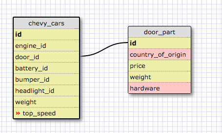
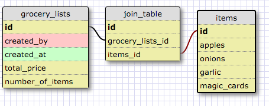

#8.5 More Schemas

##Release 2

##Release 4

## Reflection

1. What is a one-to-one database?

  A one-to-one database is a database where things are pairs. For example, a country will only have one capital, and a capital can only  have one country.

2. When would you use a one-to-one database? (Think generally, not in terms of the example you created).

  I would use it when things are pairs. If they only are related to eachother in one aspect, and nothing else.

3. What is a many-to-many database?

  A many to many database will be joined by a join table. This happens when both items can be associated with more than one of eachother.

4. When would you use a many-to-many database? (Think generally, not in terms of the example you created).

  When both items can relate to more than one of each other.

5. What is confusing about database schemas? What makes sense?

  Figuring out examples of each type of relationship was a little tough. I feel like when I have specific things I need to make a database for, it is relatively easy to make sense of what relationship it is. It is really just coming up with these off the top of my head that is difficult.